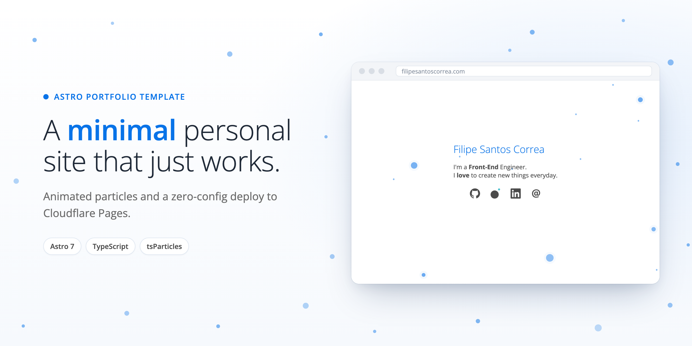

<div align="center">
  <a href="https://filipesantoscorrea.com">
    
  </a>

  <h1>filipesantoscorrea.com</h1>

  <p>
    My personal site, built to be small, fast and easy to reuse as a template.
    <br />
    <a href="https://filipesantoscorrea.com"><strong>View the live site »</strong></a>
  </p>

  <p>
    <a href="https://github.com/Safi1012/filipesantoscorrea.com/actions/workflows/pipeline.yml"></a>
    <a href="LICENSE"></a>
    
    
  </p>
</div>

## ✨ Features

- **Minimal and fast**: a single static page with no UI framework and self-hosted fonts.
- **Animated background** with [tsParticles](https://particles.js.org/). It loads only the plugins it uses, and visitors can interact with it.
- **No tracking**: no tracking cookies, analytics or third-party requests, so no consent banner is needed.
- **Deployed to Cloudflare Pages** by a GitHub Actions pipeline that lints and builds pull requests, deploys `main`, caches dependencies and pins every action to a commit SHA.
- **Modern tooling**: Astro 7, TypeScript, pnpm via corepack, ESLint (including accessibility rules) and Prettier.

## 🎢 Tech stack

| Area            | Tools                                                                                                                                     |
| :-------------- | :---------------------------------------------------------------------------------------------------------------------------------------- |
| Framework       | [Astro](https://astro.build/), [TypeScript](https://www.typescriptlang.org/)                                                              |
| Animation       | [tsParticles](https://particles.js.org/)                                                                                                  |
| Package manager | [pnpm](https://pnpm.io/) via [corepack](https://github.com/nodejs/corepack)                                                               |
| Code quality    | [ESLint](https://eslint.org/) + [eslint-plugin-astro](https://ota-meshi.github.io/eslint-plugin-astro/), [Prettier](https://prettier.io/) |
| Hosting         | [Cloudflare Pages](https://pages.cloudflare.com/), deployed via [Wrangler](https://developers.cloudflare.com/workers/wrangler/)           |
| CI/CD           | GitHub Actions                                                                                                                            |

## 🚀 Getting started

### Prerequisites

- [Node.js](https://nodejs.org/) 24 LTS (see [`.nvmrc`](.nvmrc); with nvm, run `nvm use`)
- corepack, which ships with Node.js. It installs the exact pnpm version pinned in `package.json`:

```sh
corepack enable
```

### Use this project as a template

```sh
# Copy the project without its git history
pnpm dlx degit Safi1012/filipesantoscorrea.com my-site
cd my-site

pnpm install

# Provide your legal contact details (required to build)
cp .env.example .env

pnpm dev
```

The site now runs at <http://localhost:4321>.

### Commands

| Command           | Action                                                            |
| :---------------- | :---------------------------------------------------------------- |
| `pnpm dev`        | Starts the dev server at `localhost:4321`                         |
| `pnpm build`      | Type-checks (`astro check`) and builds the site to `./dist/`      |
| `pnpm preview`    | Builds and serves the site locally with Wrangler                  |
| `pnpm run deploy` | Builds and deploys the site to Cloudflare Pages from your machine |
| `pnpm lint`       | Lints all files with ESLint (`pnpm lint:fix` to auto-fix)         |
| `pnpm prettier`   | Formats all files (`pnpm prettier:check` to only check)           |
| `pnpm astro ...`  | Runs Astro CLI commands, e.g. `pnpm astro add`                    |

## 🗂️ Project structure

```text
├── .github/
│   ├── actions/setup/     # Shared CI setup (Node, corepack, pnpm cache, install)
│   └── workflows/         # Lint, build and deploy pipeline
├── public/                # Static files served as-is (fonts, icons, manifest, robots.txt)
├── src/
│   ├── assets/            # SVG icons used on the homepage
│   ├── components/        # About, Links, Footer and the Particles background
│   ├── layouts/           # Base layout (meta tags) and the legal-page layout
│   ├── pages/             # index, legal (Impressum) and privacy
│   └── styles/            # Colors, fonts and legal-page styles
├── .env.example           # Legal contact variables, copy to .env
└── astro.config.mjs       # Site URL, image service and env schema
```

## 🎨 Make it yours

| What                    | Where                                                                                   |
| :---------------------- | :-------------------------------------------------------------------------------------- |
| Name and tagline        | [`src/components/About.astro`](src/components/About.astro)                              |
| Social links and icons  | [`src/components/Links.astro`](src/components/Links.astro), [`src/assets/`](src/assets) |
| Colors                  | [`src/styles/colors.css`](src/styles/colors.css)                                        |
| Particle animation      | [`src/components/Particles.astro`](src/components/Particles.astro)                      |
| Page title, description | [`src/layouts/Layout.astro`](src/layouts/Layout.astro)                                  |
| Domain                  | `site` in [`astro.config.mjs`](astro.config.mjs)                                        |
| App icons and manifest  | [`public/`](public)                                                                     |
| Legal details           | `.env` locally, GitHub Actions variables in CI (see below)                              |

### Environment variables

The Impressum and privacy policy read your contact details from these variables. They are defined in `astro.config.mjs`, and the build fails if any is missing, so an incomplete Impressum can never be deployed.

| Variable            | Example             |
| :------------------ | :------------------ |
| `LEGAL_NAME`        | `Jane Doe`          |
| `LEGAL_STREET`      | `Musterstr. 1`      |
| `LEGAL_POSTAL_CODE` | `12345`             |
| `LEGAL_CITY`        | `Hamburg`           |
| `LEGAL_EMAIL`       | `hello@example.com` |

> [!NOTE]
> These values are kept out of the repository, not kept secret: an Impressum has to be publicly visible, so they appear on the deployed site.

> [!IMPORTANT]
> The privacy policy describes **this** setup: hosting on Cloudflare Pages, email via iCloud Mail and no analytics. If your setup differs (another host or mail provider, analytics, embeds), update [`src/pages/privacy.astro`](src/pages/privacy.astro) to match. The legal texts are a starting point, not legal advice.

## ☁️ Deployment

The [pipeline](.github/workflows/pipeline.yml) lints and builds every pull request. On pushes to `main` it also deploys the build to Cloudflare Pages through a `production` environment.

1. **Create a Cloudflare Pages project** with direct upload, for example with `pnpm wrangler pages project create <name>`. Then set `--project-name` in [`pipeline.yml`](.github/workflows/pipeline.yml) to that name.
2. **Add repository secrets** under _Settings → Secrets and variables → Actions → Secrets_:
   - `CLOUDFLARE_API_TOKEN`: an API token with the **Account › Cloudflare Pages › Edit** permission
   - `CLOUDFLARE_ACCOUNT_ID`: your Cloudflare account ID
3. **Add repository variables** for the [legal details](#environment-variables), on the _Variables_ tab or with the GitHub CLI:

   ```sh
   gh variable set LEGAL_NAME --body "Jane Doe"
   ```

4. **Push to `main`.** GitHub creates the `production` environment on the first deploy. You can add protection rules to it later, such as required reviewers.

> [!TIP]
> Make sure Cloudflare Web Analytics and other dashboard features that inject scripts are turned off, unless you also add them to your privacy policy.

## 📄 License

The code is released under the [MIT License](LICENSE). If you use this project as a template, please replace the personal content (name, texts, links and legal details) with your own.
